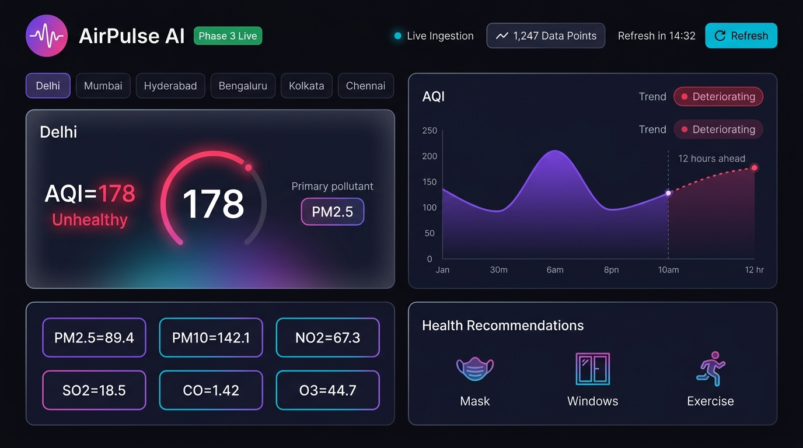

# 🌐 AirPulse — AI-Driven Real-Time Air Quality Monitoring & Analytics Platform

[](https://nodejs.org)
[](https://react.dev)
[](https://vitejs.dev)
[](https://expressjs.com)
[](https://sqlite.org)
[](LICENSE)

**AirPulse** is a full-stack, AI-inspired environmental intelligence platform that tracks atmospheric telemetry in real time across global cities using the World Air Quality Index (WAQI) API. It features time-series historical data persistence in SQLite, predictive forecasting algorithms for 6–12 hour AQI trends, proactive threshold-based smart alerting (in-app and native browser push notifications), multi-city comparison matrices, and a high-performance cyberpunk/glassmorphism UI.

---

## 🔗 Live Demo & Links

- **Repository**: [https://github.com/phanikaushik2630-ship-it/Airpluse](https://github.com/phanikaushik2630-ship-it/Airpluse)
- **🚀 Live Demo**: [https://airpluse.onrender.com](https://airpluse.onrender.com) *(Deploy via Render — see Quick Start below)*
- **Local Web Dashboard**: `http://localhost:5173`
- **Backend API Service**: `http://localhost:5000`
- **API Health & Verification**: `http://localhost:5000/api/status`

---

## 📸 Dashboard Preview



> **AirPulse AI** cyberpunk glassmorphism dashboard showing real-time Delhi AQI=178 (Unhealthy), PM2.5/PM10/NO2/SO2/CO/O3 pollutant grid, 12-hour predictive forecast chart with deteriorating trend, and health recommendations panel.

---

## ✨ Key Features

### ⚡ 1. Atmospheric Telemetry & Polling Engine
- Direct integration with the **World Air Quality Index (WAQI)** API.
- Automated background polling scheduler using `node-cron` with rate-limit protection and polite sequential queries.
- Extracts & normalizes all 6 core pollutant metrics:
  - **PM2.5** (Fine Particulate Matter)
  - **PM10** (Respirable Particulate Matter)
  - **NO2** (Nitrogen Dioxide)
  - **SO2** (Sulfur Dioxide)
  - **CO** (Carbon Monoxide)
  - **O3** (Ground-level Ozone)
- Automatic **Dominant Pollutant Driver** extraction to inform users what is actually driving hazardous air.

### 🔮 2. Predictive AI Forecasting (Phase 3)
- Lightweight statistical forecasting algorithms (moving average + linear trend slope modeling).
- Projects AQI for the next **6 to 12 hours** based on historical time-series data.
- Dual visual charting: Clearly marks historical readings vs. projected dotted forecast curve with trend velocity indicators (Improving, Deteriorating, or Stable).

### 🔔 3. Smart Threshold-Based Alert System
- **Custom City Thresholds**: Users can configure custom AQI alarm triggers per city (e.g., alert if Delhi crosses 200).
- **In-App Real-Time Banners**: Prominent neon warning badges alerting users to unhealthy spikes.
- **Browser Push Notifications**: Native Web Notification API integration alerting even when the tab is backgrounded.
- **Worst Pollutant Highlight**: Immediate insight into the specific pollutant causing the spike.

### 📊 4. Interactive Analytics & Comparison Matrix
- Side-by-side multi-city comparison view with differential color coding.
- Dynamic gauge meters, historical trend charts, and real-time station details.
- Manual sync triggers (`POST /api/poll`) and live test routes (`GET /api/test`).

---

## 🏛️ System Architecture

```
Airpluse/
├── client/                     # Frontend (React 19 + Vite + Vanilla Modern CSS)
│   ├── src/
│   │   ├── components/         # Modular UI Components
│   │   │   ├── CityCard.jsx        # Telemetry card with AQI badge & driver
│   │   │   ├── TrendChart.jsx      # Historical & predictive trend line chart
│   │   │   ├── ComparisonView.jsx  # Multi-city side-by-side comparison
│   │   │   ├── AlertSettingsModal.jsx # Custom threshold configuration modal
│   │   │   └── AlertBanner.jsx     # Active threshold breach banner
│   │   ├── App.jsx             # Main dashboard controller
│   │   ├── index.css           # Modern Cyberpunk / Glassmorphic Design System
│   │   └── main.jsx            # React root mount
│   ├── package.json
│   └── vite.config.js
│
├── src/                        # Backend API & Worker Service (Express + SQLite)
│   ├── config/
│   │   ├── index.js            # Centralized environment loader & defaults
│   │   └── aqiStandards.js     # EPA/CPCB AQI health categories & color standards
│   ├── controllers/
│   │   └── aqiController.js    # Express route handlers
│   ├── db/
│   │   ├── database.js         # SQLite connection & schema initializer
│   │   └── readingsRepository.js # Data access layer (CRUD & analytics)
│   ├── routes/
│   │   └── aqiRoutes.js        # API routing definitions
│   └── services/
│       ├── waqiService.js      # WAQI API client with error recovery
│       ├── forecastService.js  # 6-12 hr trend prediction calculations
│       └── schedulerService.js # Periodic cron polling scheduler
│
├── data/
│   └── .gitkeep                # SQLite storage volume
├── test_endpoints.js           # Automated backend test suite
├── server.js                   # Application entry point
├── package.json                # Backend dependencies & npm scripts
├── .env.example                # Sample environment configuration
└── README.md                   # Project documentation
```

---

## 🚀 Quick Start Guide

### Prerequisites
- [Node.js](https://nodejs.org/) (v18 or higher recommended)
- [Git](https://git-scm.com/)
- Free WAQI API Token (Optional, instant access at [aqicn.org/data-platform/token/](https://aqicn.org/data-platform/token/))

### 1. Clone the Repository
```bash
git clone https://github.com/phanikaushik2630-ship-it/Airpluse.git
cd Airpluse
```

### 2. Install Dependencies
```bash
# Install backend dependencies
npm install

# Install frontend dependencies
cd client
npm install
cd ..
```

### 3. Environment Configuration
Create a `.env` file in the root directory (or copy from `.env.example`):
```ini
PORT=5000
WAQI_API_TOKEN=your_token_here
MONITORED_CITIES=Delhi,Mumbai,Hyderabad,Bengaluru,Kolkata,Chennai
POLL_INTERVAL_CRON=*/15 * * * *
```
*(Note: AirPulse includes fallback mock data generators so you can run and test everything immediately even without an API token!)*

### 4. Run Locally

#### Option A: Running with Concurrent Terminals
**Terminal 1 (Backend API):**
```bash
npm run dev
# Server running at http://localhost:5000
```

**Terminal 2 (Frontend Dashboard):**
```bash
npm run client
# Dashboard running at http://localhost:5173
```

---

## 📡 API Endpoints Reference

| Method | Endpoint | Description |
| :--- | :--- | :--- |
| `GET` | `/` | API Information & Directory |
| `GET` | `/api/status` | System health, scheduler status & row counts |
| `GET` | `/api/test` | Live test telemetry for sample cities |
| `GET` | `/api/cities` | Latest readings for all monitored cities |
| `GET` | `/api/aqi/:city` | Current real-time reading & pollutant breakdown |
| `GET` | `/api/history/:city`| Historical time-series data for trend visualization |
| `GET` | `/api/forecast/:city`| **Phase 3**: 6–12 hour predictive AQI trend forecast |
| `POST`| `/api/poll` | Trigger an immediate manual polling ingestion cycle |

---

## 🧪 Testing

Execute the automated test suite to verify database connection, WAQI integration, and all endpoints:
```bash
npm test
```

---

## 🛡️ License

This project is open source and available under the [ISC License](LICENSE).
